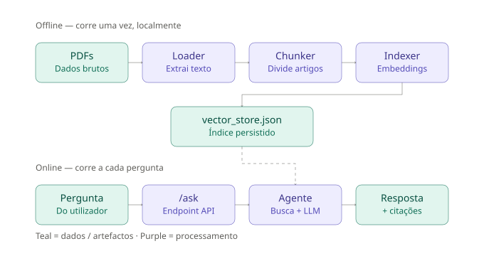
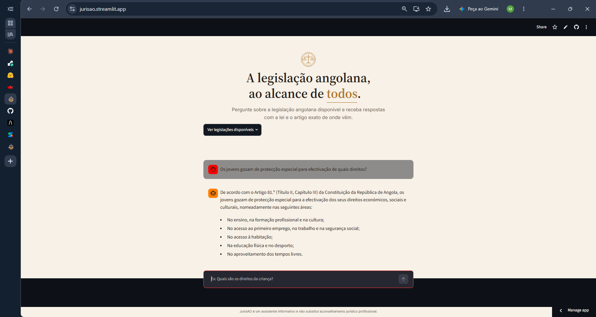

# JurisAO

Agente de Inteligência Artificial que responde a perguntas sobre legislação angolana (Constituição da República e Código Penal / Código do Processo Penal), com respostas fundamentadas e citação da fonte legal exata (lei, título, capítulo, secção e artigo).

Projeto desenvolvido no âmbito do **Challenge Alura Agente**, programa **Oracle Next Education (ONE)** — parceria Alura + Oracle.

> ⚠️ Este assistente é meramente informativo e não substitui aconselhamento jurídico profissional.

---

## Índice

- [Visão geral](#visão-geral)
- [Arquitetura](#arquitetura)
- [Tecnologias utilizadas](#tecnologias-utilizadas)
- [Estrutura do repositório](#estrutura-do-repositório)
- [Como executar localmente](#como-executar-localmente)
- [Exemplos de utilização](#exemplos-de-utilização)
- [Deploy](#deploy)
- [Limitações conhecidas e próximos passos](#limitações-conhecidas-e-próximos-passos)
- [Direitos e licença](#direitos-e-licença)

---

## Visão geral

A legislação angolana é pública, mas continua distante de quem mais precisa dela. Muitos angolanos recorrem a ferramentas de IA generalistas, como o ChatGPT, para perguntar sobre os seus direitos e deveres perante a lei — sem saber que essas ferramentas não têm acesso direto ao texto legal angolano, e podem simplesmente inventar respostas com total confiança. Do outro lado, quem tenta ler a lei diretamente esbarra noutro obstáculo: artigos escritos em linguagem técnica, difíceis de interpretar sem formação jurídica, dentro de documentos tão extensos que percorrê-los à procura de uma resposta concreta é, por si só, uma tarefa desanimadora.

O JurisAO nasce para preencher esse espaço: um agente de IA que só responde com base no texto real da lei angolana — nunca por adivinhação — e que cita sempre o artigo exato de onde a informação vem, para que a resposta possa ser verificada, não apenas confiada.

Funcionalidades principais:

- Leitura e processamento de documentos legais em PDF (Constituição e Código Penal/Processo Penal angolanos)
- Divisão automática do texto por **artigo**, preservando hierarquia legal (lei, parte, livro, título, capítulo, secção, subsecção)
- Deteção automática de mudança de lei dentro do mesmo documento, com filtragem de ruído de publicação (cabeçalhos de página, numeração, blocos de assinatura)
- Busca semântica (embeddings multilingues) sobre os artigos
- Reescrita automática da pergunta do utilizador para vocabulário jurídico, melhorando a qualidade da recuperação
- Respostas geradas por LLM (Google Gemini), restritas exclusivamente ao conteúdo recuperado, com citação obrigatória da fonte
- API REST (FastAPI) para consumo externo

---

## Arquitetura



O projeto está dividido em duas fases claramente separadas:

**Pipeline offline** (corre uma vez, localmente, não faz parte do runtime da aplicação):
1. **Loader** — lê os PDFs (`langchain_community.PyPDFLoader`)
2. **Chunker** — percorre o texto linha a linha, deteta hierarquia legal e mudanças de lei (com filtragem de ruído de publicação), e divide o conteúdo em chunks por artigo, cada um com metadata completa (`lei`, `parte`, `livro`, `titulo`, `capitulo`, `seccao`, `subseccao`, `artigo`)
3. **Indexer** — gera embeddings (modelo multilingue open-source) para cada chunk e constrói o vector store
4. O vector store é **persistido em disco** (`vector_store.json`), evitando reprocessar os documentos (~10 min) a cada arranque da aplicação

**Pipeline online** (corre a cada pergunta, é o que está em produção):
1. A pergunta do utilizador chega ao endpoint `POST /ask`
2. O agente **reescreve a pergunta** em terminologia jurídica formal, para melhorar a busca
3. É feita busca por similaridade no vector store (já carregado em memória, ~1s)
4. Os artigos recuperados são formatados como contexto e inseridos num prompt estruturado
5. O LLM gera a resposta, restrita ao conteúdo fornecido, com citação obrigatória da lei/artigo
6. A API devolve a resposta e a lista de fontes usadas

---

## Tecnologias utilizadas
 
| Categoria | Tecnologia |
|---|---|
| Linguagem | Python 3.12+ |
| Orquestração LLM | LangChain |
| Extração de PDF | `langchain_community.PyPDFLoader` (pypdf) |
| Modelo de linguagem | Google Gemini (`gemini-2.5-flash`) via `langchain-google-genai` |
| Embeddings | `sentence-transformers/paraphrase-multilingual-mpnet-base-v2` via `langchain-huggingface` |
| Vector store | `InMemoryVectorStore` (langchain-core), com persistência em disco |
| API | FastAPI + Uvicorn |
| Frontend (deploy) | Streamlit — interface web publicamente deployada |
| Frontend (alternativo, uso local) | HTML + CSS + JavaScript puro, servido como ficheiro estático pela FastAPI |
| Validação de dados | Pydantic |
| Gestão de segredos | python-dotenv |
 
---
 
## Estrutura do repositório
 
```
jurisao/
├── data/
│   ├── raw/                        # PDFs originais (Constituição, Código Penal)
│   └── processed/
│       └── vector_store.json       # índice já processado e persistido
├── docs/
│   └── architecture.svg
├── src/
│   ├── config.py                   # carrega variáveis de ambiente (API key)
│   ├── ingestion/
│   │   ├── loader.py               # carrega PDFs
│   │   ├── chunker.py              # divide por artigo, deteta hierarquia e lei
│   │   └── indexer.py              # gera embeddings e o vector store
│   ├── util/
│   │   ├── constants.py            # padrões de hierarquia, ruído de página, etc.
│   │   └── doc_standardization.py  # deteção de cabeçalhos, mudança de lei
│   ├── agent/
│   │   ├── retriever.py            # carrega o vector store e faz busca por similaridade
│   │   ├── prompts.py              # prompt do sistema e construção de contexto
│   │   └── chain.py                # junta retrieval híbrido + reescrita de pergunta + LLM
│   └── api/
│       ├── main.py                 # entrypoint FastAPI (serve API + frontend estático)
│       ├── routes.py               # endpoints /ask e /health
│       └── schemas.py              # modelos Pydantic de request/response
├── static/
│   └── index.html                  # interface web alternativa (HTML/CSS/JS puro, para uso local com FastAPI)
├── streamlit_app.py                 # interface deployada publicamente (Streamlit Community Cloud)
├── .env.example
├── .gitignore
├── requirements.txt
└── README.md
```
 
---
 
## Como executar localmente
 
### 1. Clonar o repositório e criar o ambiente virtual
 
```bash
git clone <url-do-repositorio>
cd jurisao
python -m venv venv
venv\Scripts\activate        # Windows
source venv/bin/activate     # macOS/Linux
pip install -r requirements.txt
```
 
### 2. Configurar a chave da API
 
Cria um ficheiro `.env` na raiz do projeto (usa `.env.example` como modelo):
 
```
GEMINI_API_KEY=a_tua_chave_do_google_ai_studio
```
 
Obtém uma chave gratuita em [aistudio.google.com](https://aistudio.google.com).
 
### 3. Gerar o índice (só é preciso uma vez)
 
```bash
python -m src.ingestion.indexer
```
 
Isto processa os PDFs em `data/raw/` e grava `data/processed/vector_store.json`. Demora alguns minutos (geração de embeddings em CPU) — só precisa de correr uma vez; execuções seguintes da aplicação carregam o índice já pronto em segundos.
 
### 4. Correr a aplicação
 
**Opção A — Interface Streamlit** (a mesma usada no deploy público):
```bash
streamlit run streamlit_app.py
```
 
**Opção B — API FastAPI + interface HTML própria:**
```bash
uvicorn src.api.main:app --reload
```
Acede a `http://127.0.0.1:8000/` para a interface web, ou a `http://127.0.0.1:8000/docs` para a documentação interativa da API (Swagger), onde também podes testar o endpoint `/ask` diretamente.
 
---
 
## Exemplos de utilização
 
### Pergunta
> "Os jovens gozam de protecção especial para efectivação de quais direitos?"
 
### Resposta
> De acordo com o Artigo 81.º (Título II, Capítulo III) da Constituição da República de Angola, os jovens gozam de proteção especial para a efetivação dos seus direitos económicos, sociais e culturais, nomeadamente: no ensino, na formação profissional e na cultura; no acesso ao primeiro emprego, no trabalho e na segurança social; no acesso à habitação; na educação física e no desporto; e no aproveitamento dos tempos livres.
 
### Pergunta
> "Se eu assassinar alguém sem querer qual será a pena?"
 
### Resposta
> De acordo com o Artigo 152.º (Livro II, Título I, Capítulo I, Secção I) do Código Penal Angolano, quem matar outra pessoa por negligência (quando o ato resulta de falta de cuidado ou imprudência, sem intenção de matar) é punido com pena de prisão até 3 anos. Se a negligência for considerada grosseira (uma forma muito grave de descuido ou irresponsabilidade), a pena de prisão aplicável é de 1 a 5 anos.
>
> Nota sobre a sua situação pessoal: como descreveu um caso pessoal e pede orientação, lembro que não posso aplicar a lei ao seu caso específico nem dizer-lhe que ação tomar. O que a lei estabelece em geral está descrito acima; para aconselhamento sobre um caso concreto, deve procurar um advogado.
 
### Via API (curl)
 
```bash
curl -X POST http://127.0.0.1:8000/ask \
  -H "Content-Type: application/json" \
  -d '{"question": "Quais são os direitos da criança segundo a Constituição?", "k": 4}'
```
 
---
 
## Deploy
 
A aplicação está publicamente acessível em:
 
**🔗 [https://jurisao.streamlit.app/](https://jurisao.streamlit.app/)**
 

 
> **Nota sobre a plataforma de deploy:** o enunciado do challenge sugere a OCI, mas deixa explícito que "não são obrigações" e que qualquer ferramenta é aceitável desde que a solução funcione. A OCI exige verificação por cartão de crédito, que não foi possível concluir (cartão pré-pago rejeitado pela Oracle). O deploy final foi feito no **Streamlit Community Cloud** (1 GB de RAM, sem cartão), com a interface reconstruída em Streamlit para se integrar nativamente com essa plataforma. A interface HTML/CSS/JS original (`static/index.html`) mantém-se no repositório como demonstração para uso local com a API FastAPI.
 
---
 
## Limitações conhecidas e próximos passos
 
- **Documentos adicionais**: Lei Geral do Trabalho, Lei de Proteção de Dados Pessoais e outras leis angolanas ainda não estão integradas — ficam como próximo passo natural, dado que o pipeline de ingestão já é genérico o suficiente para as suportar.
- **Anexos da Constituição** (Bandeira, Insígnia, Hino Nacional) não são indexados, por não seguirem a estrutura "por artigo" e terem baixa relevância para perguntas jurídicas típicas.
- **Texto residual em 4 artigos**: os últimos artigos de cada um dos quatro textos legais fundidos no PDF do Código Penal podem conter, colado ao fim, o bloco de assinaturas de promulgação do documento original.
- **Qualidade da recuperação em artigos vizinhos**: a busca combina a pergunta original com uma versão reescrita em termos jurídicos formais (busca híbrida), o que melhora significativamente a recuperação. Ainda assim, em secções com muitos artigos relacionados (ex: vários artigos seguidos sobre o mesmo crime), o artigo exato mais relevante pode nem sempre estar entre os `k` primeiros resultados — nesses casos, o agente responde honestamente que não encontrou a informação, em vez de inventar.
- **Memória de conversa**: cada pergunta é processada de forma independente; o agente não mantém histórico da conversa. Fica como próximo passo (exigiria gerir estado de sessão no `chain.py` e na interface).
- **Script de inspeção de novos documentos** (deteção automática de ruído de publicação para novas fontes) está planeado mas ainda não implementado como ferramenta reutilizável.
- Número da página de origem ainda não está incluído na metadata dos chunks (ficou para uma iteração futura).
---
 
## Direitos e licença
 
© 2026 Moisés da Costa Calinhiqui. Todos os direitos reservados.
 
Este projeto é disponibilizado publicamente para fins de avaliação do Challenge Alura Agente (programa Oracle Next Education — parceria Alura/Oracle). Não é permitida a reprodução, distribuição ou uso comercial sem autorização prévia do autor.
 
Os documentos legais utilizados (Constituição da República de Angola, Código Penal Angolano) são atos oficiais do Estado angolano, publicados no Diário da República para distribuição pública.